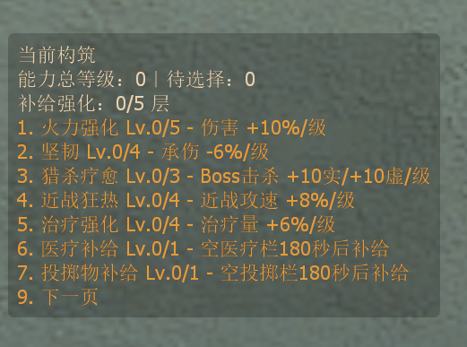
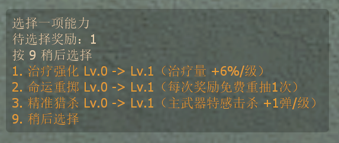
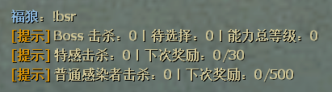

# Boss Slayer Roguelite

[](LICENSE)


一个面向《求生之路 2》合作战役的 SourceMod 肉鸽成长插件。玩家通过击杀或参与击杀 Boss、击杀特殊感染者与普通感染者，以及推进章节获得局内升级选择；构筑按照 SteamID 保存，可跨章节和个人死亡延续，团灭后回滚到当前章节开始时的状态。

## 游戏预览

| 当前构筑 | 能力选择 |
|---|---|
|  |  |



## 当前功能

| 行为 | 奖励 |
|---|---:|
| 最后击杀 Tank/Witch | 2 次升级选择 |
| 存活并参与击杀 Tank/Witch | 1 次升级选择 |
| 累计击杀 30 只普通特殊感染者 | 1 次升级选择 |
| 累计击杀 500 只普通感染者 | 1 次升级选择 |
| 进入第一章之后的新章节 | 1 次升级选择 |

- 每次奖励随机显示最多三个未满级技能。
- 关闭菜单不会失去未使用的奖励，输入 `!perk` 可以重新打开。
- 能力选择和满级兑换菜单使用数字键 `9` 稍后选择；未列出的数字键也会安全关闭并保留奖励。
- 所有技能满级后，多余奖励可以兑换 20+20 生命、满备弹、随机医疗物资或随机投掷物。
- 构筑以 SteamID 为键保存在服务器内存中，章节切换和短线重连不会串号。
- 只有正常完成章节触发的 `map_transition` 会延续构筑；退出旧地图后重新开图或直接换图会视为新战役并从初始状态开始。
- 玩家个人死亡不会丢失构筑；团灭或关卡失败时回滚到进入本章时的状态。
- 完成战役时清除全员构筑。
- 不使用数据库，插件重载或服务器关闭后数据自然消失。
- 根据每位玩家的 SourceMod 语言自动显示英文或简体中文，英文作为回退语言。
- 所有能力和进度仅对真人幸存者生效；闲置 Bot、普通 Bot 和 Bot 接管不会继承或累计构筑。
- 插件只在标准合作战役 `coop` 和写实战役 `realism` 中生效；对抗、生还者、清道夫和突变模式均禁用。
- `!perks` 使用分页菜单展示构筑：`8` 返回上一页、`9` 进入下一页，首尾页只显示可用方向，其他数字键关闭菜单。
- 聊天消息支持最简、正常和详细三个等级。

## 环境要求

- Left 4 Dead 2
- Metamod:Source
- SourceMod 1.12 或更新的兼容版本
- Windows PowerShell（仅开发脚本需要）

当前版本只使用 SourceMod 标准 API，不需要 Left 4 DHooks 等第三方扩展。

## 快速安装

服务器已经安装 Metamod:Source 和 SourceMod 后，将发布包解压到包含 `left4dead2` 文件夹的游戏/服务器根目录，然后执行：

```text
sm plugins reload boss_slayer
sm plugins info boss_slayer
```

插件成功加载后，普通玩家不需要安装 VPK 或客户端文件；插件、翻译和配置都运行在服务器端。完整文件位置和源码构建方法见下文。

## 能力池

| 能力 | 最高等级 | 每级效果 | 满级效果 |
|---|---:|---:|---:|
| 火力强化 | 5 | 直接伤害 +10% | +50% |
| 坚韧 | 4 | 战斗、火焰、酸液和友伤 -6% | -24% |
| 猎杀疗愈 | 3 | 击杀 Boss 恢复 10 真实＋10 临时生命 | 30＋30 |
| 近战狂热 | 4 | 近战攻击速度 +8% | +32% |
| 治疗强化 | 4 | 医疗包、止痛药和肾上腺素治疗量 +6% | +24% |
| 医疗补给 | 1 | 连续 180 秒没有任何医疗物资时随机获得一个 | 固定效果 |
| 投掷物补给 | 1 | 连续 180 秒没有投掷物时随机获得一个 | 固定效果 |
| 命运重掷 | 1 | 每次奖励可以免费重抽一次选项 | 固定效果 |
| 战地救援 | 4 | 救起倒地和挂边队友速度 +8% | +32% |
| 弹药回收 | 3 | 击杀普通特感恢复主武器最大备弹 2% | 6%/次 |
| 急救反馈 | 3 | 给队友使用医疗包后自身获得 5 临时生命 | 15 临时生命 |
| 精准猎杀 | 3 | 使用榴弹发射器以外的主武器击杀普通特感时向弹匣返还 1 发 | 3 发/次 |
| 补给强化 | 1 | 每章首次使用补给品叠加五项属性各 2% | 五项各 +10% |
| 求生律动 | 2 | 有效生命低于 40 时每 30 秒获得 10 临时生命 | 20/次 |

近战狂热现在每级提高 8%，满级为 32%。火力强化不会提高友军伤害。坚韧不减免坠落、溺水、地图处决和挂边掉落等非战斗伤害。生命恢复受正常最大有效生命限制。

补给强化只在每个章节第一次成功使用医疗包、止痛药、肾上腺素或投掷物时增加一层，最多五层。每层同时提供 2% 直接伤害、减伤、救援速度、治疗量和近战攻速。

## 安装

服务器必须已经安装 Metamod:Source 和 SourceMod。将以下三个文件复制到对应位置：

```text
left4dead2/
└─ addons/sourcemod/
   ├─ plugins/boss_slayer.smx
   └─ translations/
      ├─ boss_slayer.phrases.txt
      └─ chi/boss_slayer.phrases.txt
```

插件第一次加载后会自动生成：

```text
left4dead2/cfg/sourcemod/boss_slayer.cfg
```

服务器已经运行时执行：

```text
sm plugins reload boss_slayer
sm plugins info boss_slayer
```

只修改翻译文件时还可以执行：

```text
sm_reload_translations
```

人工审校全部英文和简体中文文本：

```powershell
.\scripts\generate-translation-audit.ps1 -Open
```

该命令会在浏览器打开 `dist/translation-audit.html`，并列出全部 phrase key、格式参数、中英文内容、UTF-8 字节数与基本检查结果。VS Code 中也可以运行任务 `Boss Slayer: Open Translation Audit`。

普通玩家不需要安装任何文件；服务器安装插件后，连接该服务器的玩家会直接使用插件功能。

## 服务器配置

平衡数值位于 `left4dead2/cfg/sourcemod/boss_slayer.cfg`。常用配置包括：

```cfg
sm_bsr_chat_level "1"
sm_bsr_debug_commands "0"

sm_bsr_boss_killer_rewards "2"
sm_bsr_boss_participant_rewards "1"
sm_bsr_si_kills_per_reward "30"
sm_bsr_si_kill_rewards "1"
sm_bsr_common_kills_per_reward "500"
sm_bsr_common_kill_rewards "1"
sm_bsr_chapter_rewards "1"

sm_bsr_firepower_per_level "0.10"
sm_bsr_toughness_per_level "0.06"
sm_bsr_melee_speed_per_level "0.08"
sm_bsr_healing_boost_per_level "0.06"
sm_bsr_supply_interval "180.0"
sm_bsr_low_health_interval "30.0"
sm_bsr_precision_hunter_rounds_per_level "1"
```

`sm_bsr_chat_level` 的含义：

| 值 | 输出内容 |
|---:|---|
| `0` | 能力选择、失败回滚和战役清零等必要信息 |
| `1` | 再显示奖励、章节补偿和补给等正常反馈，默认值 |
| `2` | 再显示周期回血、猎杀疗愈等被动触发详情 |

配置值通过 ConVar 动态读取，修改后通常无需重新编译。配置文件不存在时，换图或重新加载插件会重新生成默认文件。完整默认值、范围以及仍由代码固定的规则见 [服务器配置说明](docs/configuration.md)。

从旧版本升级时，如果现有 `boss_slayer.cfg` 中没有 `sm_bsr_debug_commands`，请手动加入：

```cfg
sm_bsr_debug_commands "0"
```

## 权限与管理

| 层级 | 命令 | 默认权限 |
|---|---|---|
| 玩家 | `!bsr`、`!perk`、`!perks` | 所有人 |
| 开发调试 | `sm_bsr_test*`、`sm_bsr_resetme` | `ADMFLAG_CHEATS`，管理标志 `n` |
| 全员重置 | `sm_bsr_resetall` | `ADMFLAG_ROOT`，管理标志 `z` |

开发调试命令有两道限制：调用者必须拥有 `n` 权限，并且服务器必须设置：

```cfg
sm_bsr_debug_commands "1"
```

该开关默认关闭。正式服务器建议保持 `0`；本地测试时临时设为 `1`。`sm_bsr_resetall` 不受调试开关影响，但始终要求 ROOT 权限。

服务器所有者可以通过 `addons/sourcemod/configs/admin_overrides.cfg` 调整单个命令所需的管理标志，例如：

```text
Overrides
{
    "sm_bsr_testreward"    "b"
}
```

即使通过 override 放宽权限，调试命令仍然要求 `sm_bsr_debug_commands "1"`。所有成功的测试数据修改、个人重置和全员重置都会写入 `addons/sourcemod/logs/`，包含执行管理员的 SourceMod 身份信息。

## 玩家命令

| 命令 | 说明 |
|---|---|
| `!bsr` | 查看击杀、待选奖励和技能等级状态 |
| `!perk` | 打开一次尚未使用的升级选择 |
| `!perks` | 打开分页菜单查看当前构筑 |

开发调试命令（默认关闭，要求 `n` 权限）：

| 命令 | 作用范围 | 说明 |
|---|---|---|
| `!bsr_testreward [1-100]` | 自己 | 增加指定数量的测试奖励；省略数量时增加 1 次 |
| `!bsr_testsikills <数量>` | 自己 | 模拟特殊感染者击杀 |
| `!bsr_testcommonkills <数量>` | 自己 | 模拟普通感染者击杀 |
| `!bsr_testperk <0-13> <等级>` | 自己 | 设置指定能力等级 |
| `!bsr_testsupplystacks <0-5>` | 自己 | 设置补给强化层数 |
| `!bsr_testmaxperks` | 自己 | 点满全部能力并增加一次兑换奖励 |
| `!bsr_resetme` | 自己 | 清除自己的构筑并重写本章初始快照 |

ROOT 运维命令：

| 命令 | 说明 |
|---|---|
| `sm_bsr_resetall` | 清除服务器内存中的全员构筑，不受调试开关影响 |

## 从源码构建

克隆仓库：

```powershell
git clone https://github.com/gofurry/l4d2-plugin-boss_slayer.git
cd l4d2-plugin-boss_slayer
```

复制本机配置模板：

```powershell
Copy-Item .\scripts\config.example.ps1 .\scripts\config.local.ps1
```

编辑 `config.local.ps1`，将 `$GameRoot` 指向本机的 `left4dead2` 目录，然后执行：

```powershell
.\scripts\build.ps1
```

产物位于：

```text
dist/boss_slayer.smx
```

编译并复制到本机游戏目录：

```powershell
.\scripts\deploy.ps1
```

该脚本会同步部署 `.smx`、英文翻译和简体中文翻译。

生成可直接解压到服务器的 GitHub Release ZIP：

```powershell
.\scripts\package.ps1
```

安装包会生成在 `dist/` 目录中。

`config.local.ps1`、编译产物和本机 VS Code 路径配置均已被 Git 忽略。

## VS Code

推荐安装 [SourcePawn Studio](https://marketplace.visualstudio.com/items?itemName=Sarrus.sourcepawn-vscode)。

1. 复制 `.vscode/settings.example.json` 为 `.vscode/settings.json`。
2. 填写本机 `spcomp.exe`、SourceMod include 和项目 include 路径。
3. 用 VS Code 打开整个仓库目录。
4. 执行 `SM: Doctor` 检查环境。

快捷任务：

- `Ctrl+Shift+B`：只编译。
- `Tasks: Run Task` → `Boss Slayer: Build and Deploy`：编译并部署。

## 源码结构

```text
src/boss_slayer.sp                 插件入口
include/boss_slayer/
├─ definitions.inc                版本、常量、技能枚举
├─ state.inc                      全局运行状态
├─ config.inc                     ConVar 与自动配置文件
├─ messages.inc                   双语消息与聊天详细程度
├─ game_mode.inc                  合作/写实战役模式边界
├─ storage.inc                    SteamID 与玩家数据
├─ chapter_snapshot.inc           章节初始状态与失败回滚
├─ perks.inc                      技能目录与随机池
├─ boss_tracking.inc              Tank/Witch 参与判定
├─ effects.inc                    伤害、治疗和近战攻速
├─ supplies.inc                   周期补给与备弹恢复
├─ rescue.inc                     救援速度状态
├─ exchange_menu.inc              全技能满级后的兑换菜单
├─ perk_menu.inc                  三选一菜单
├─ rewards.inc                    Boss、特感、小怪、章节奖励
├─ events.inc                     游戏事件
├─ commands.inc                   玩家与调试命令
└─ lifecycle.inc                  地图和客户端生命周期

translations/
├─ boss_slayer.phrases.txt        英文回退翻译
└─ chi/boss_slayer.phrases.txt    简体中文翻译

scripts/validate-translations.ps1 翻译格式与键同步检查
```

所有模块最终编译成一个 `boss_slayer.smx`，不需要管理多个插件的加载顺序。

## 开发与测试

修改 SourcePawn 后必须运行：

```powershell
.\scripts\build.ps1
```

游戏内检查项目见 [回归测试清单](docs/test-checklist.md)。Codex 项目约束见 [AGENTS.md](AGENTS.md)。

## 许可证

本项目采用 [MIT License](LICENSE)。
